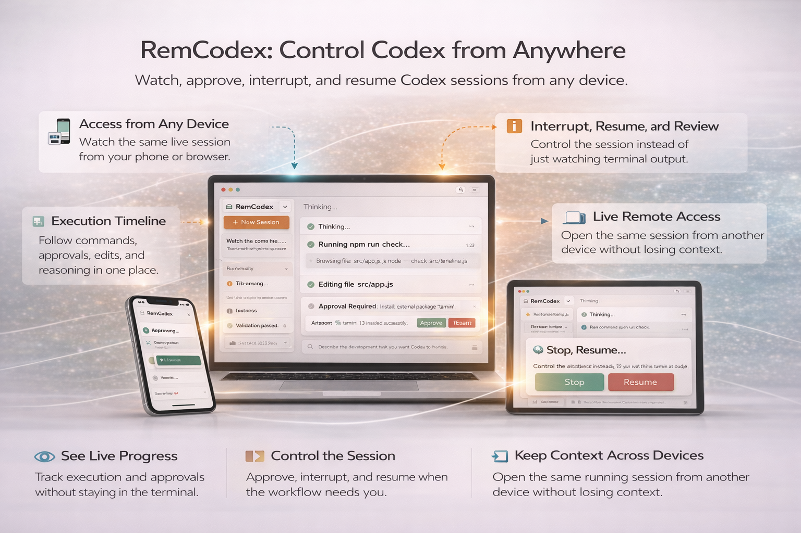
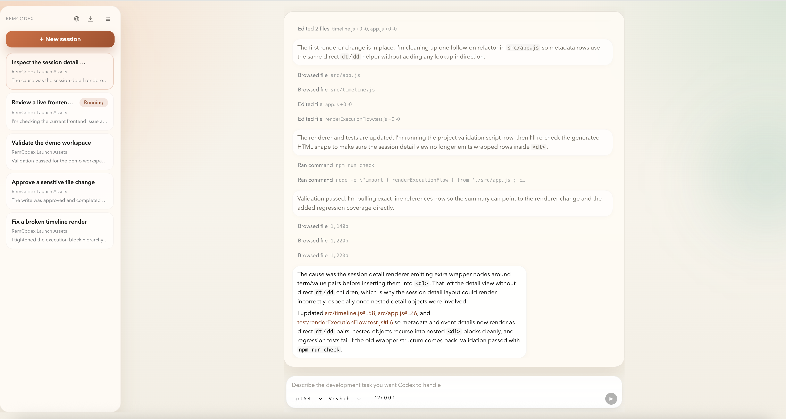
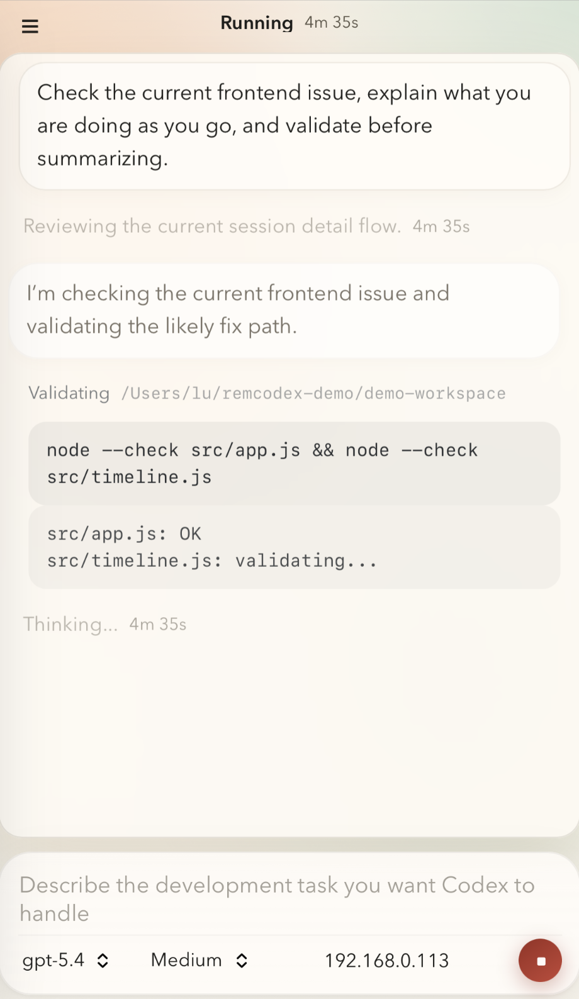
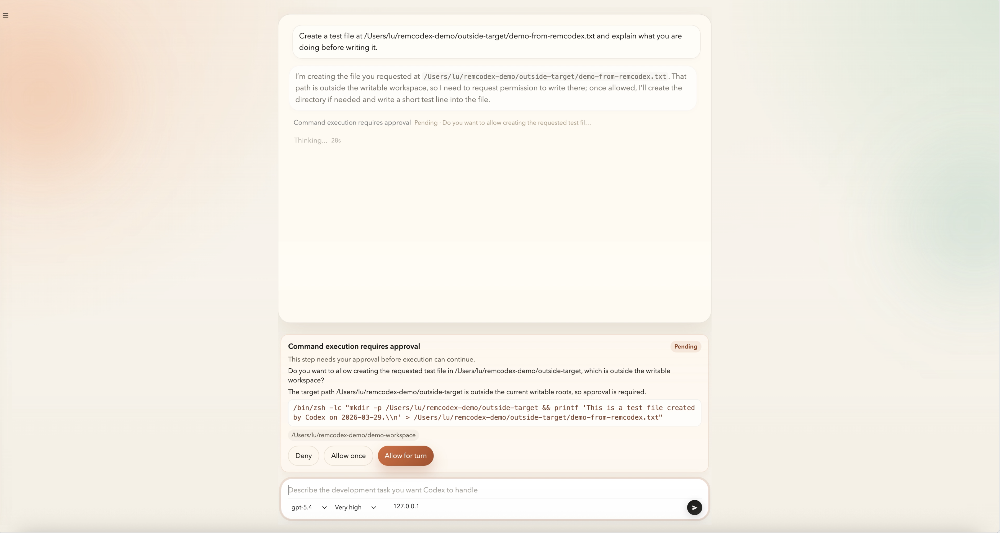
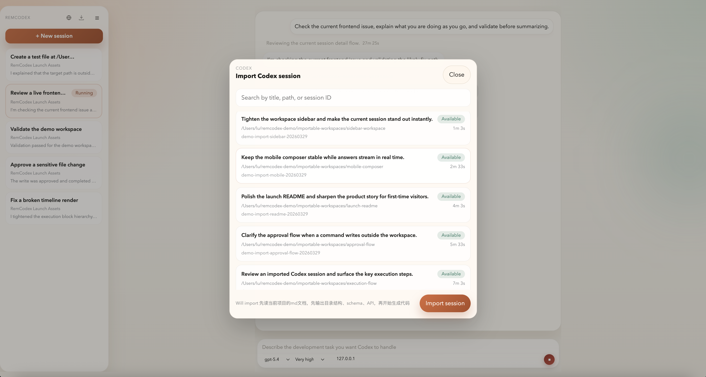

# 🚀 RemCodex

> Control your AI coding agent from anywhere.  
> Built for Codex. Ready for more.

Run Codex once on your computer.  
Watch, approve, and control it from any device.

> Not a wrapper. Not a proxy.  
> A real-time control layer for AI execution.  
> Turns AI execution into a controllable system.



---

## ✨ What is RemCodex?

RemCodex is a **local-first control layer for Codex**.

It turns AI execution into a **controllable system** —  
visible, interruptible, and continuous.

- 👀 See what the AI is doing — in real time
- ✅ Approve or reject actions before execution
- ⏹ Interrupt or stop at any moment
- 📱 Access your session from any device
- 🔄 Sessions don’t break — they resume

> One session. Any device.

---

## 🎬 A real workflow

You start a long Codex session on your machine.

Then you leave your desk.

On your phone:

- you see progress in real time
- you receive an approval request
- you approve it

The session continues instantly.

> Everything else can disconnect — your session won’t.

---

## 🔥 Why RemCodex exists

AI coding agents are powerful.  
But today, they run like a black box.

You either:

- trust everything blindly
- or sit in front of your terminal watching it

RemCodex fixes that.

> AI is no longer a black box.

---

## ⚡ What it does

- Real-time execution timeline (messages, commands, approvals)
- Human-in-the-loop command approval
- Multi-device access to the same live session
- Resume after refresh, sleep, or reconnect
- Browser-based UI — **no extra client required**
- Works with Codex CLI

> No extra client install. Just open a browser.  
> Your code never leaves your machine.

---

## 🚀 Quick start

```bash
npx remcodex
```

Then open:

http://127.0.0.1:18840

Access from another device:

http://<your-ip>:18840

> Runs entirely on your local machine. No cloud, no data upload.

---

## 🖥 Screenshots



> Run and review Codex sessions in a single-page workspace.



> Follow a live Codex session from your phone.



> Approve sensitive file-system actions from the UI.



> Bring imported Codex rollouts into the same workspace.

---

## 🧠 What it actually is

RemCodex is a **browser-based workspace for Codex sessions**.

It is built for real workflows:

- long-running sessions
- mobile check-ins
- approval prompts
- imported rollout history
- timeline-style execution flow

Instead of raw terminal logs, you get a structured, visual timeline you can follow and control.

---

## 🧩 Current product shape

- Single-page workspace UI
- Left sidebar for session navigation
- Right-side execution timeline
- Fixed input composer
- Semantic timeline rendering for:
    - user messages
    - assistant output
    - thinking
    - commands
    - patches
    - approvals
    - system events

---

## ⚙️ Key behaviors

### Approvals

- Writes inside working area → auto allowed
- Writes outside → require approval
- `Allow once` / `Allow for this turn` supported
- Approval history stays visible in timeline

---

### Timeline

- Semantic rendering (not raw logs)
- Commands grouped into readable activity blocks
- Running / failed states clearly visible
- Smooth streaming + recovery after refresh

---

### Imported sessions

- Import from `~/.codex/sessions/...`
- Keep syncing if still active
- Unified view with native sessions

---

## 🧠 Architecture

```
Codex CLI → Event stream → Semantic layer → Timeline → Web UI
```

---

## ⚙️ Requirements

- Node.js
- Codex CLI (already working locally)

---

## ⚙️ Configuration

Default port: **18840**

```bash
PORT=18841 npx remcodex
```

---

## 📦 Install FAQ

### Why does `npx remcodex` hang on Linux?

First install may compile native deps:

- `better-sqlite3`
- `node-pty`

Make sure you have:

- `python3`
- `make`
- `g++`

---

### Debug install issues

```bash
npm install -g remcodex
remcodex doctor
remcodex start
```

---

### Headless mode

```bash
npx remcodex --no-open
```

---

## 🔧 How it works

1. Codex emits events
2. Backend stores them (SQLite)
3. Frontend loads timeline snapshot
4. Live updates stream via WebSocket

Result:

- recoverable sessions
- real-time UI
- consistent execution flow

---

## 📊 Status

- Beta / developer preview
- Local-first architecture
- No cloud dependency

---

## 🗺 Roadmap

**Visibility**

- fully observable execution
- clear action timeline

**Control**

- fine-grained approvals
- safer execution

**Continuity**

- survive refresh / sleep
- stable long runs

**Access**

- control from any device

**Integration**

- IDE integrations
- optional sharing

---

## 👥 Who it’s for

- developers already using Codex
- people tired of terminal-only workflows
- anyone who wants **control, not just output**
- multi-device workflows

---

## ⚠️ What’s not finished yet

- no polished installer yet
- no desktop packaging
- no production-grade auth
- no release pipeline

If you're comfortable running a local Node app —  
you can use it today.

---

## 📄 License

MIT License
